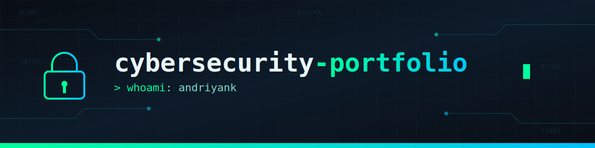

# 🔐 Andryan Kurniawan — Cybersecurity Portfolio

**Blue Team → Red Team | Pentesting | Security Research**

Welcome! This repository showcases my cybersecurity projects, labs, and ongoing learning journey.

## 📜 Certifications

CEHv12 

---
CompTIA Security+ (SY0-701)

| ✅ Official Verification | **[View Verification](https://cp.certmetrics.com/CompTIA/en/public/verify/credential/CTSYWCGY01BE16TJ)** |

| 🏅 Credly Digital Badge | **[View Badge](https://www.credly.com/badges/d9f014a0-3789-4c5c-b9fb-da50a3f65ec7/public_url)** |

---
AWS Certified Cloud Practitioner *(in progress)*

---
## 📫 Connect

- [LinkedIn](https://www.linkedin.com/in/andriyan-k/)
- [TryHackMe](https://tryhackme.com/p/andriyank/)

## 🧰 Technical Skills

### Blue Team

- Security Operations Center (SOC)
- Security Analyst / SOC Analysis
- Threat Hunting
- Incident Response
- Log Analysis
- SIEM (Splunk, Elastic, Trellix, Wazuh)

### Red Team

- Vulnerability Assessment
- Web Penetration Testing
- OWASP Top 10
- SQL Injection
- XSS
- IDOR
- Broken Access Control
- Burp Suite

### Infrastructure

- Windows
- Linux
- Docker
- WSL2
- SafeLine WAF
---
## 🎧 Background Music

.mp3)

---
## 🚀 Featured Projects

### 🔹 Wazuh 4.14 Installation on Low-Spec Hardware

Complete hands-on guide for deploying Wazuh 4.14 (Indexer, Manager, Dashboard, Filebeat) on hardware below official recommended specs (2-core CPU, 5.7GB RAM, HDD) — includes 12 real-world troubleshooting cases: race conditions, certificate errors, API sync issues, and heap tuning.
📂 [View Repository](https://github.com/andriyank/Wazuh-4.14-Installation-on-Linux-Mint-22.2-Low-Spec-Hardware)

### 🔹 Kali Linux (WSL) + Docker + SafeLine WAF — Home Lab Setup

Home security lab built with Kali Linux (WSL2), Docker, and SafeLine WAF on a Windows 11 laptop. Includes reverse proxy configuration and penetration testing against common web attacks (XSS, SQL Injection, Path Traversal/File Inclusion), with full attack logs and WAF detection analysis.
📂 [View Repository](https://github.com/andriyank/Kali-Linux-WSL-Docker-SafeLine-WAF-Home-Lab-Setup)

### 🔹 Penetration Testing: Broken Access Control / IDOR

Hands-on testing of Broken Access Control and IDOR (Insecure Direct Object Reference) against DVWA, deployed behind SafeLine WAF. Demonstrates how signature-based WAFs fail to detect logic-layer vulnerabilities — includes Forced Browsing and IDOR test scenarios, WAF log verification, and root-cause analysis mapped to OWASP Top 10 (A01:2021) and CWE-639/CWE-862.
📂 [View Repository](https://github.com/andriyank/Penetration-Testing-Broken-Access-Control-IDOR)

## 🎯 Currently Learning

- Burp Suite Web Testing *(in progress)*
- Qualys Training *(in progress)*

## 📊 GitHub Stats

---

### 🎵 Music Credits

**Track:** Powered  
**Artist:** Aylex  
**Source:** https://freetouse.com/music
